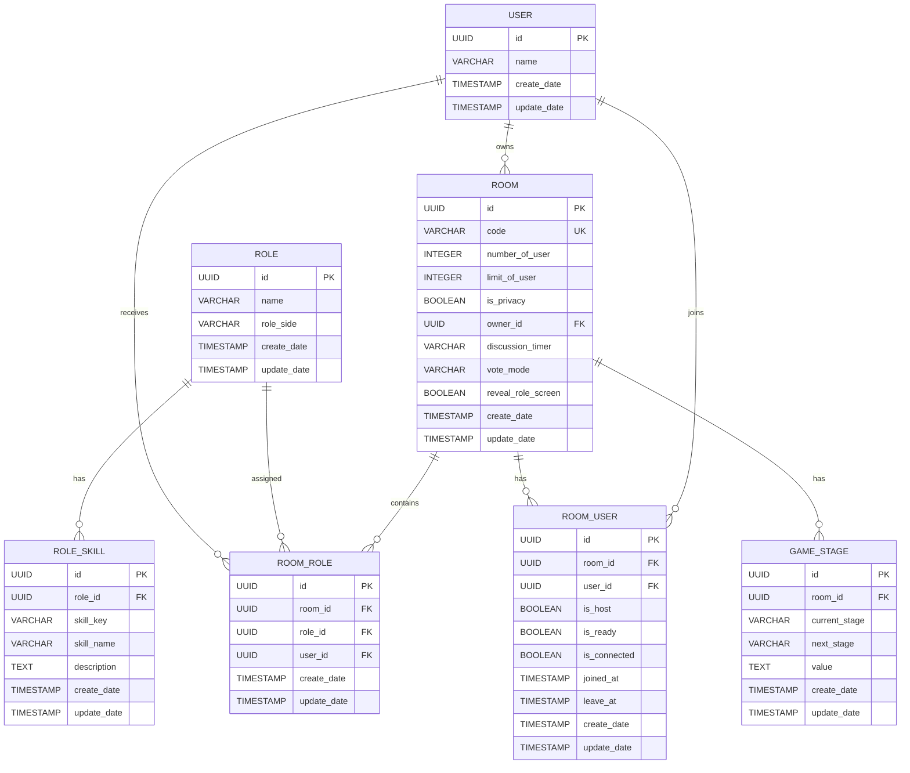

```mermaid
erDiagram
    USER {
        UUID id PK
        VARCHAR name
        TIMESTAMP create_date
        TIMESTAMP update_date
    }

    ROLE {
        UUID id PK
        VARCHAR name
        VARCHAR role_side
        TIMESTAMP create_date
        TIMESTAMP update_date
    }

    ROOM {
        UUID id PK
        VARCHAR code UK
        INTEGER number_of_user
        INTEGER limit_of_user
        BOOLEAN is_privacy
        UUID owner_id FK
        VARCHAR discussion_timer
        VARCHAR vote_mode
        BOOLEAN reveal_role_screen
        TIMESTAMP create_date
        TIMESTAMP update_date
    }

    ROOM_ROLE {
        UUID id PK
        UUID room_id FK
        UUID role_id FK
        UUID user_id FK
        TIMESTAMP create_date
        TIMESTAMP update_date
    }

    ROLE_SKILL {
        UUID id PK
        UUID role_id FK
        VARCHAR skill_key
        VARCHAR skill_name
        TEXT description
        TIMESTAMP create_date
        TIMESTAMP update_date
    }

    GAME_STAGE {
        UUID id PK
        UUID room_id FK
        VARCHAR current_stage
        VARCHAR next_stage
        TEXT value
        TIMESTAMP create_date
        TIMESTAMP update_date
    }

    ROOM_USER {
        UUID id PK
        UUID room_id FK
        UUID user_id FK
        BOOLEAN is_host
        BOOLEAN is_ready
        BOOLEAN is_connected
        TIMESTAMP joined_at
        TIMESTAMP leave_at
        TIMESTAMP create_date
        TIMESTAMP update_date
    }

    USER ||--o{ ROOM : owns
    USER ||--o{ ROOM_USER : joins
    ROOM ||--o{ ROOM_USER : has

    ROOM ||--o{ ROOM_ROLE : contains
    ROLE ||--o{ ROOM_ROLE : assigned
    USER ||--o{ ROOM_ROLE : receives

    ROLE ||--o{ ROLE_SKILL : has
    ROOM ||--o{ GAME_STAGE : has
```
