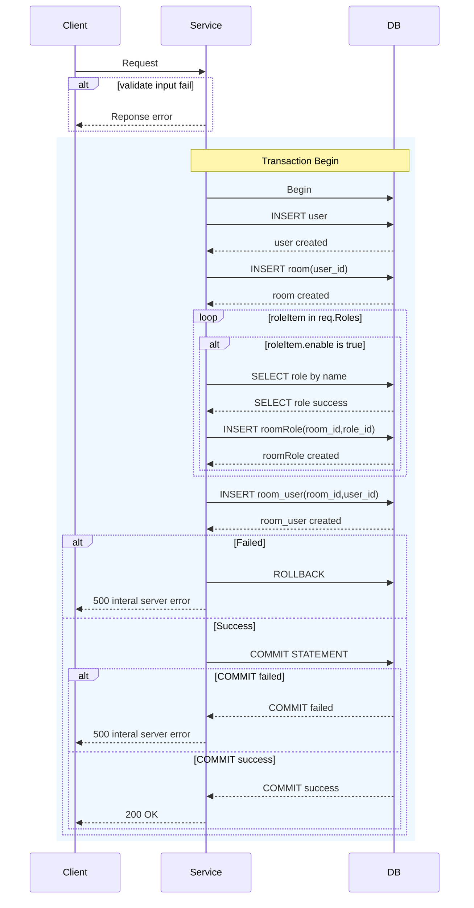

```mermaid
sequenceDiagram
    participant Client
    participant Service
    participant DB

    Client->>Service: Request

    alt validate input fail
        Service-->>Client: Reponse error
    end

    rect rgb(240, 248, 255)
        Note over Service,DB: Transaction Begin
            Service->>DB: Begin
            Service->>DB: INSERT user
            DB-->>Service: user created

            Service->>DB: INSERT room(user_id)
            DB-->>Service: room created

            loop roleItem in req.Roles
                alt roleItem.enable is true
                    Service->>DB:SELECT role by name
                    DB-->>Service: SELECT role success
                    Service->>DB: INSERT roomRole(room_id,role_id)
                    DB-->>Service: roomRole created
                end
            end

            Service->>DB: INSERT room_user(room_id,user_id)
            DB-->>Service: room_user created
            alt Failed
                Service->>DB: ROLLBACK
                Service-->>Client: 500 interal server error
            else Success
                Service->>DB: COMMIT STATEMENT
                alt COMMIT failed
                    DB-->>Service: COMMIT failed
                    Service-->>Client: 500 interal server error
                else COMMIT success
                    DB-->>Service: COMMIT success
                    Service-->>Client: 200 OK
                end
            end

    end
```
