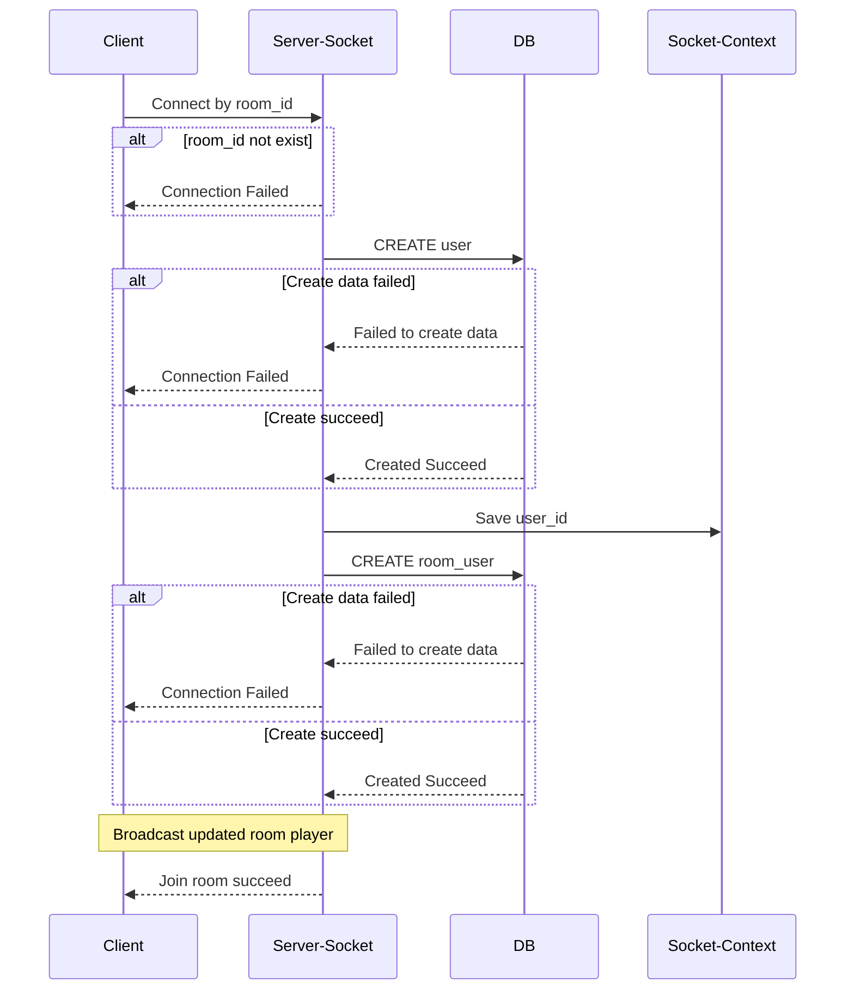

- Socket Message

```json
{
  "stage": "LOBBY",
  "type": "JOIN_ROOM",
  "message": {
    "user_name": "donald548"
  }
}
```

- Socket Broadcast

```json
    "data":{
        "userId":"ad93e256-f1e4-489a-b3d9-27f53f6cf5b6",
        "userName":"donald548" //true,false
    }
```


