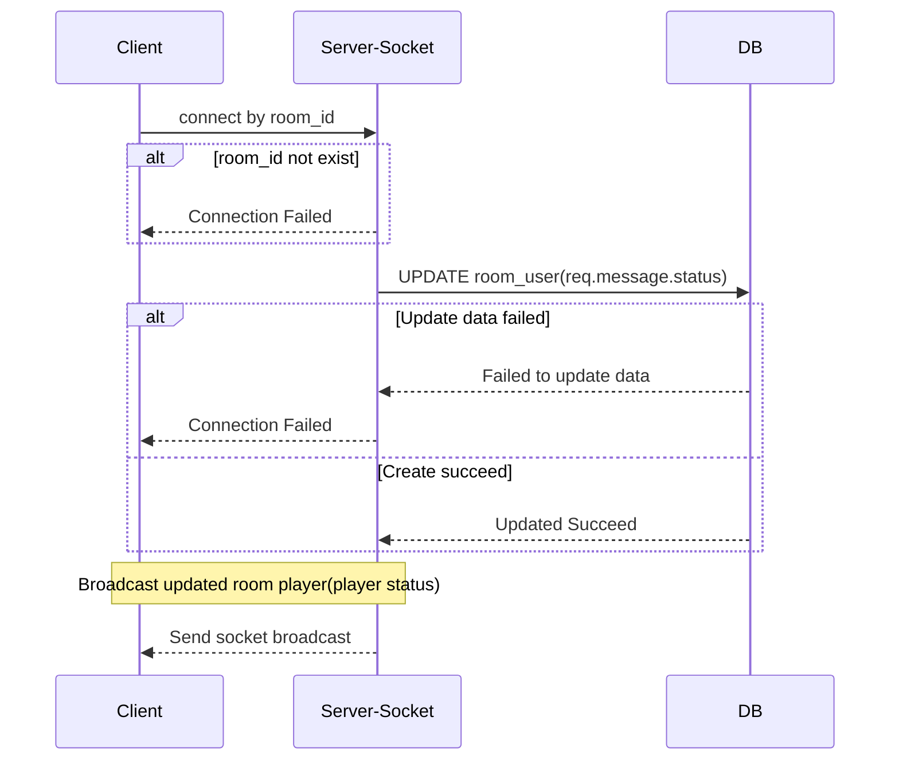

- Socket Message

```json
{
  "stage": "LOBBY",
  "type": "UPDATE_STATUS",
  "message": {
    "status": true // true,false
  }
}
```

- Socket Broadcast

```json
{
  "data": {
    "userId": "ad93e256-f1e4-489a-b3d9-27f53f6cf5b6",
    "status": true //true , false
  }
}
```


